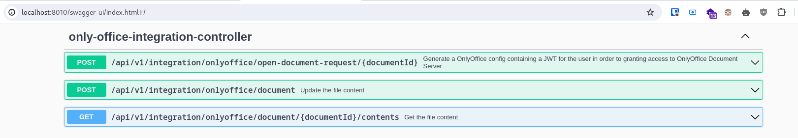

# OnlyOffice Spring Boot Starter

This started add required endpoints to your SpringBoot application for onlyoffice document edition.

## Endpoints



## Configuration

### Properties

```yml
# application.yml

onlyoffice:
  jwt-secret: WlEJf7hdzCEGwTWkO89i
  app-server-base-url: "http://trodix.local:8010"
```

### Beans implementation

```java
package com.trodix.duckcloud.domain.config;

import com.trodix.duckcloud.domain.models.ContentModel;
import com.trodix.duckcloud.domain.models.FileLocationParts;
import com.trodix.duckcloud.domain.models.FileStoreMetadata;
import com.trodix.duckcloud.domain.services.NodeService;
import com.trodix.duckcloud.domain.utils.StorageUtils;
import com.trodix.duckcloud.persistance.entities.Node;
import com.trodix.duckcloud.persistance.entities.Property;
import com.trodix.duckcloud.persistance.utils.NodeUtils;
import com.trodix.onlyoffice.models.OfficeDocument;
import com.trodix.onlyoffice.services.OnlyOfficeDocumentService;
import lombok.RequiredArgsConstructor;
import lombok.extern.slf4j.Slf4j;
import org.springframework.http.HttpStatus;
import org.springframework.stereotype.Component;
import org.springframework.web.server.ResponseStatusException;

@Component
@RequiredArgsConstructor
@Slf4j
public class OnlyOfficeDocumentAdapter implements OnlyOfficeDocumentService {

    private final NodeService nodeService;

    @Override
    public OfficeDocument findById(String documentId) {
        Node node = nodeService.getOne(Long.parseLong(documentId))
                .orElseThrow(() -> new ResponseStatusException(HttpStatus.NOT_FOUND, "Node " + documentId + " not found"));

        final Property nameProp = NodeUtils.getProperty(node.getProperties(), ContentModel.PROP_NAME)
                .orElseThrow(() -> new ResponseStatusException(HttpStatus.NOT_FOUND, "Property: " + ContentModel.PROP_NAME + " not found for nodeId " + documentId));

        final Property createdAtProp = NodeUtils.getProperty(node.getProperties(), ContentModel.PROP_CREATED_AT)
                .orElseThrow(() -> new ResponseStatusException(HttpStatus.NOT_FOUND, "Property: " + ContentModel.PROP_CREATED_AT + " not found for nodeId " + documentId));

        final Property modifiedAtProp = NodeUtils.getProperty(node.getProperties(), ContentModel.PROP_MODIFIED_AT)
                .orElseThrow(() -> new ResponseStatusException(HttpStatus.NOT_FOUND, "Property: " + ContentModel.PROP_MODIFIED_AT + " not found for nodeId " + documentId));

        OfficeDocument document = new OfficeDocument();
        document.setId(node.getId().toString());
        document.setFileName(nameProp.getStringVal());
        document.setCreatedAt(createdAtProp.getDateVal());
        document.setModifiedAt(modifiedAtProp.getDateVal());

        return document;
    }

    @Override
    public void updateContent(OfficeDocument document, byte[] content) {

        Node node = nodeService.getOne(Long.parseLong(document.getId()))
                .orElseThrow(() -> new ResponseStatusException(HttpStatus.NOT_FOUND, "Node " + document.getId() + " not found"));

        String documentName = NodeUtils.getProperty(node.getProperties(), ContentModel.PROP_NAME)
                .orElseThrow(() -> new IllegalStateException("Property " + ContentModel.PROP_NAME + " not fount on nodeId " + node.getId())).getStringVal();

        String contentLocation = NodeUtils.getProperty(node.getProperties(), ContentModel.PROP_CONTENT_LOCATION)
                .orElseThrow(() -> new ResponseStatusException(HttpStatus.NOT_FOUND, "Property: " + ContentModel.PROP_CONTENT_LOCATION + " not found for nodeId " + node.getId())).getStringVal();

        FileLocationParts parts = StorageUtils.getFileLocationParts(contentLocation);

        String documentId;

        try {
            documentId = parts.getDocumentUUID();
        } catch (IllegalArgumentException e) {
            String msg = "Property: " + ContentModel.PROP_CONTENT_LOCATION + " is invalid for nodeId " + node.getId();
            log.error(msg, e);
            throw new ResponseStatusException(HttpStatus.NOT_FOUND, msg);
        }

        FileStoreMetadata fileStoreMetadata = new FileStoreMetadata();
        fileStoreMetadata.setContentType("application/vnd.openxmlformats-officedocument.wordprocessingml.document"); // FIXME
        fileStoreMetadata.setUuid(documentId);
        fileStoreMetadata.setBucket(parts.getBucket());
        fileStoreMetadata.setOriginalName(documentName);

        nodeService.updateNodeContent(node, fileStoreMetadata, content);
    }

    @Override
    public byte[] getDocumentContent(String documentId) {

        Node node = nodeService.getOne(Long.parseLong(documentId))
                .orElseThrow(() -> new ResponseStatusException(HttpStatus.NOT_FOUND, "Node " + documentId + " not found"));

        final byte[] data;

        try {
            data = nodeService.getFileContent(node);
        } catch (RuntimeException e) {
            throw new ResponseStatusException(HttpStatus.NOT_FOUND, "Filecontent not found for nodeId " + node.getId());
        }

        return data;
    }

}
```

```java
package com.trodix.duckcloud.domain.config;

import com.trodix.duckcloud.security.services.AuthenticationService;
import com.trodix.duckcloud.security.services.KeycloakService;
import com.trodix.onlyoffice.models.UserRepresentation;
import com.trodix.onlyoffice.services.OnlyOfficeUserService;
import lombok.RequiredArgsConstructor;
import lombok.extern.slf4j.Slf4j;
import org.springframework.stereotype.Component;

@Component
@RequiredArgsConstructor
@Slf4j
public class OnlyOfficeUserAdapter implements OnlyOfficeUserService {

    private final AuthenticationService authenticationService;
    private final KeycloakService keycloakService;


    @Override
    public String getUserId() {
        return authenticationService.getUserId();
    }

    @Override
    public String getName() {
        return authenticationService.getName();
    }

    @Override
    public UserRepresentation fetchUserProfile(String userId) {
        org.keycloak.representations.idm.UserRepresentation keycloakRep = keycloakService.fetchUserProfile(userId);

        UserRepresentation representation = new UserRepresentation();
        representation.setId(keycloakRep.getId());
        representation.setEmail(keycloakRep.getEmail());
        representation.setUsername(keycloakRep.getUsername());
        representation.setLastName(keycloakRep.getLastName());

        return representation;
    }

    @Override
    public String getDefaultUser() {
        return AuthenticationService.DEFAULT_USER;
    }

    @Override
    public String getDefaultEmail() {
        return AuthenticationService.DEFAULT_EMAIL;
    }

}
```